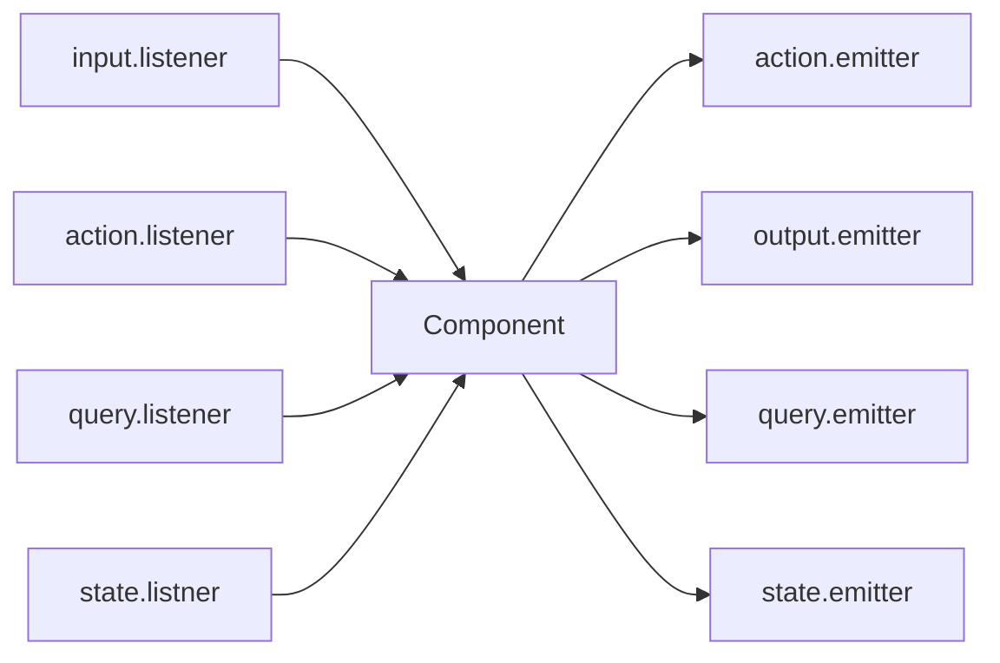

# Test.Spec.Halogen

A Purescript module that adds utilities for automated Halogen component testing.

```haskell
spec :: Spec Unit
spec = withComponent componentSpec input do
  describe "My Component" do
    it "should trigger internal actions" $ ReaderT do
      trigger (Action.AddUser user)
    it "should detect outputs" $ ReaderT do
      trigger (Action.AddUser user) `shouldRaise` Output.AddedUserSuccessfully
    it "can provide access to state" $ ReaderT do
      trigger (Action.AddUser user)
      stateShouldSatisfy \s -> s.numUsers == 1
```

# Prepping Component for testing

## Expose `ComponentSpec` in module

When testing, we use `mkTestComponent` to create a thin wrapper over the original component that provides access to internal `Action` and `State`. If  created a component

```haskell
module MyComponent (component, componentSpec)

component :: Component q i o m
component = mkComponent myComponentSpec

componentSpec :: ComponentSpec 
ComponentSpec s q a sl i o m = ...
```


## Create class instances for `Action` and `Output`
To use the assertions defined in `Test.Spec.Halogen.Assertions`, we need to be able to test `Action` and `Output` for equality. These instances can be created automatically by using `derive instance Eq _`.

```haskell
data Action = Action1 | Action2
derive instance Eq Action

data Output = Finished | Flailing
derive instance Eq Output
```

A `Show` instance for `Action` and `Output` may also be required. Write your tests and define `Show` instances when the compiler complains. `Show` instances can also be derived via `Generic`.

```haskell
derive instance Generic Action _
instance Show Action where
  show = genericShow
```

# Writing tests

```haskell
withComponent :: ...
  TestComponent ...
  -> input
  -> SpecT Aff TestHalogenConfig m a
  -> SpecT Aff Unit m a
```


```haskell
withComponent (mkTestComponent componentSpec) input do
  describe "My Component" do
    it "test1" \testConfig ->
      


```





