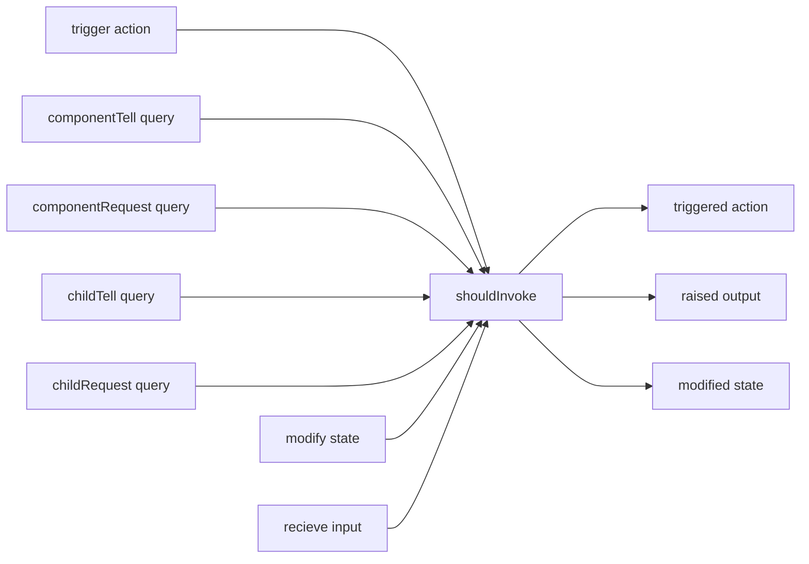

# Test.Spec.Halogen

A Purescript module that adds utilities for automated Halogen component testing.

```haskell
spec :: Spec Unit
spec = withComponent componentSpec input do
  describe "My Component" do
    it "should trigger internal actions" $ ReaderT do
      trigger (Action.AddUser user)
    it "should detect outputs" $ ReaderT do
      trigger (Action.AddUser user) `shouldRaise` Output.AddedUserSuccessfully
    it "can provide access to state" $ ReaderT do
      trigger (Action.AddUser user)
      stateShouldSatisfy \s -> s.numUsers == 1
```

## Linguistic choices

A Halogen component has a large number of type variables that constrain operations on the component.

- `state` is the component's state
- `query` is the query algebra; the requests that can be made of the component
- `action` is the type of actions; messages internal to the component that can be evaluated
- `slots` is the set of slots for addressing child components
- `input` is the input value that will be received when the parent of this component renders
- `output` is the type of messages the component can raise

When a `ComponentSpec` is reified into a `Component`, most of these type variables become hidden:

`mkComponent :: ComponentSpec state query action slots input output m -> Component query input output m`

But during testing, we want to be able to trigger actions from outside

| Halogen | Spec-Halogen |
| -- | -- |
| `query` | `AugmentedQuery state query action slots input output` |
| `output` | `AugmentedOutput state query action slots input output` |
| `Component query input output` | `TestComponent state query action slots input output` |
| `HalogenIO query output m` | `TestHalogenIO state query action slots input output m` |

The Spec-Halogen equivalents expose the

# Usage
Test are have two parts:
  - An **Action**, which describes an operation to be performed on the component, and
  - A **Predicate**, which decribe what we expect to happen to the component when the operation is performed.

The action and the predicate are combined with the `shouldInvoke`:

```
action (Action.AddUser user) `shouldInvoke` raised Output.AddedUserSuccessfully
```

Every operation performed on a TestComponent has a [collocated verb](https://ellii.com/blog/verb-collocations) with a past and present tense.

The **present tense** is used when performing an operation.  The **past tense** creates predicates used to test that an operation was induced.

| Operation type | Operation (Present tense) | Predicate (Past tense) |
| -- | -- | -- |
| State | `modify state` |  `modified state` |
| Query | `tell query` <br> `request query` |   |
| ChildQuery | `tellChild` <br> `requestChild query` |   |
| Action | `trigger action` | `triggered action` |
| Input | `recieve input` |  |
| Ouput | | `raised output` |

The grammar for creating halogen component tests is:

**OPERATION** `shouldInvoke` **PREDICATE** [**OTHER OPTIONS**]



## Operations
Operations do things to the component.


## Predicates
The predicates used by this library are *Incremental* predicates (I don't know a better name). They work more like a parser; taking a bunch of observations and eventually returning either `Unsatisfied` or `Satisfied true`. More rarely they'll return `Satisfied false` if your predicates use negation.

Most of the time, you'll only need an atomic predicate to describe the internal state of your component post-action:

```haskell
describe "atomic predicates" do
  it "ensures that the user mitch can be deleted" do
    componentQuery (DeleteUser "mitch") `shouldInvoke` triggered DBAction

  it "calls a sub action" do
    trigger (Compute "1+1") `shouldInvoke` trigger (Addition 1 1)
```

`IncrementalPredicate` has a `HeytingAlgebra` instance, which means predicates can be used with heyting algebra functions:

```haskell
do
  -- predicate succeeds when either `a` or `b` is satisfied
  action1 `shouldInvoke` (a || b)

  -- predicate succeeds when `a` is satisfied and also b is satisfied
  action2 `shouldInvoke` (a && b)

  -- predicate succeeds when `a` is not satisfied
  action3 `shouldInvoke` (not a)
```

There is also a `then_` predicate that is satisfied when a
  


# Prepping Component for testing

## Expose `ComponentSpec` in module

When testing, we use `mkTestComponent` to create a thin wrapper over the original component that provides access to internal `Action` and `State`. The spec used to create the component should also be exported from the module. 

```haskell
module MyComponent (component, componentSpec)

component :: Component q i o m
component = mkComponent myComponentSpec

componentSpec :: ComponentSpec 
ComponentSpec s q a sl i o m = ...
```


## Create instances for `Action` and `Output` and ???
To use the assertions defined in `Test.Spec.Halogen.Assertions`, we need to be able to test `Action` and `Output` for equality. These instances can be created automatically by using `derive instance Eq _`.

```haskell
data Action = Action1 | Action2
derive instance Eq Action

data Output = Finished | Flailing
derive instance Eq Output
```

A `Show` instance for `Action` and `Output` may also be required. Write your tests and define `Show` instances when the compiler complains. `Show` instances can also be derived via `Generic`.

```haskell
derive instance Generic Action _
instance Show Action where
  show = genericShow
```

## Make recursive `handleAction` or `handleQuery` calls 

Consider a `Component` action that calls another action:

```haskell
handleAction = case _ of
  Double num -> modify_ (mul 2)
  Quadruple num -> -- want to call Double twice to quadruple the value  
```

The easiest way of doing this would be calling `handleAction` recursively:

```
-- WRONG
handleAction = case _ of
  Double -> modify_ (mul 2)
  Quadruple -> handleAction Double *> handleAction Double
```

Unfortunatly this will not trigger an Action properly. Instead, trigger the action from your component's `eval` function:

```
-- CORRECT
eval :: HalogenQ query action input a -> HalogenM state action slots output m a
eval = mkEval (defaultEval { handleAction = handleAction })

handleAction = case _ of
  Double -> modify_ (mul 2)
  Quadruple -> eval (HQ.Action Double unit) *> eval (HQ.Action Double unit)
```

# Writing tests

```haskell
withComponent :: ...
  TestComponent ...
  -> input
  -> SpecT Aff TestHalogenConfig m a
  -> SpecT Aff Unit m a
```


```haskell
withComponent (mkTestComponent componentSpec) input do
  describe "My Component" do
    it "test1" \testConfig ->
      


```

### I want to preserve component state between tests!


### My component needs more time to process an operation!
Use the `setTimeout` combinator from Test.Spec.Halogen.Driver. Since infix functions in purescript are right-associative, you don't even need parens!

```haskell
it "should complete " do
  timelyOperation `shouldInduce` whatever `setTimeout` (Milliseconds 5000.0)
```

### I want to assert that an action is performed exactly `n` times!

To write tests that require repetition, you should

